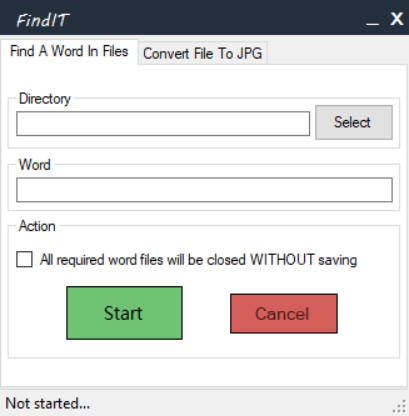

# SearchInDocs

Multithreaded application created during remote studying in order to simplify process of looking for some importang information in many Word files. 📖

## Two different technologies are up to you:
1. WF (ready [ ❗ IN DEVELOP BRANCH ❗ ])
2. WPF (in develop)

## How to use: 
1. Launch the the preferable variant of the app 
2. Provide a directory where you wanna to search for
3. Provide a word to be searched for
4. Press "Search" btn. 

## UIs: 
#### WF - 

#### WPF - [ with rounded edges]
